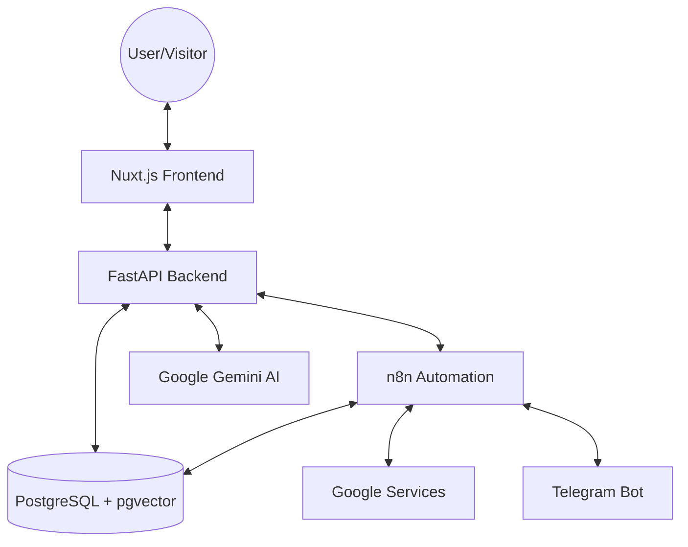

# Architecture Overview: Elite Estate

This document describes the high-level architecture and technology stack of the real estate automation system.

## 🏗 System Architecture

The project follows a **Containerized Micro-Architecture** approach, using Docker to isolate and connect multiple specialized services.



---

## 🛠 Technology Stack

### 1. Frontend (The Client Layer)
- **Type**: Full-stack Web Framework
- **Primary Tech**: [Nuxt 3](https://nuxt.com/) (Vue.js 3)
- **Language**: TypeScript/JavaScript
- **Styling**: Tailwind CSS
- **Features**:
  - Server-Side Rendering (SSR) for SEO.
  - Interactive Property Browsing.
  - Integration with Backend APIs for Auth and Data.

### 2. Backend (The Logic Layer)
- **Type**: RESTful API Service (Modular Service-Router Pattern)
- **Primary Tech**: [FastAPI](https://fastapi.tiangolo.com/) (Python)
- **ORM**: SQLAlchemy
- **Database**: PostgreSQL
- **Key Features**:
  - JWT Authentication & Role-Based Access Control (RBAC).
  - RAG (Retrieval-Augmented Generation) pipeline for the AI Assistant.
  - Transactional reporting (Safe Plain-Text format).

### 3. Database & Search
- **Relational Storage**: PostgreSQL
- **Semantic Search**: `pgvector` extension for storing and querying AI embeddings.
- **Cloud Storage**: ImageKit for property images and assets.

### 4. Automation & Integration (The Workflow Layer)
- **Engine**: [n8n](https://n8n.io/) (Self-hosted)
- **Role**: Handles complex, asynchronous workflows:
  - **Google Calendar**: Real-time meeting sync and reminders.
  - **Telegram**: Intelligent bot service for leads and property inquiries.
  - **Notifications**: Emailing reports and alerts.

### 5. Artificial Intelligence
- **Models**: Google Gemini 1.5 Pro & Embedding-001.
- **Capability**: Intelligent property Q&A, sentiment analysis for leads, and automated report summaries.

---

## 📂 Project Structure

```text
real-estate-automation/
├── backend/                    # FastAPI Application (Service-Router Pattern)
│   ├── main.py                 # Entry point, router registration
│   ├── models.py               # SQLAlchemy Database Models
│   ├── schemas.py              # Pydantic data validation schemas
│   ├── auth.py                 # Core Security engine (JWT & RBAC)
│   ├── database.py             # DB connection & Session management
│   ├── routers/                # API Endpoints (Domain-specific)
│   │   ├── auth.py             # Login, Register, Profile, Admin
│   │   ├── properties.py       # Listings, Search, RAG Q&A
│   │   ├── visits.py           # Scheduling, Inquiries, Reminders
│   │   └── reports.py          # Approvals, Transaction reports
│   ├── services/               # External Integrations (Service Pattern)
│   │   ├── ai.py               # Gemini AI & RAG logic
│   │   ├── email.py            # SMTP & HTML Email templates
│   │   └── storage.py          # ImageKit Cloud Storage
│   ├── utils/                  # Internal helpers (e.g., embeddings.py)
│   ├── init_schema.sql         # Database schema snapshot
│   ├── seed.py                 # Initial data seeding script
│   ├── requirements.txt        # Python dependencies
│   ├── Dockerfile              # Backend container config
│   ├── reports/                # Generated transaction reports (.txt)
│   └── static/                 # Seed images and property uploads
├── frontend/                   # Nuxt.js 3 Application
│   ├── app/                    # Core application logic
│   │   ├── app.vue             # Root component
│   │   ├── components/         # Reusable Vue components (ai, property, ui)
│   │   ├── composables/        # Shared logic (useApi, useAssetUrl)
│   │   ├── layouts/            # Page layouts (Default, Dashboard)
│   │   ├── pages/              # Routing & Views (admin, agency, agent, properties)
│   │   └── stores/             # State management (auth.ts)
│   └── Dockerfile              # Frontend container config
├── n8n_workflows/              # Exported n8n JSON workflows
├── docs/                       # Technical guides and architecture docs
├── data/                       # Persistent volumes (n8n, PostgreSQL)
└── infrastructure/             # Orchestration (Docker Compose, Env)
```

### Folder Breakdown

- **`backend/`**: Follows a modular **Service-Router** pattern.
  - **Routers**: Handle API routing and request/response validation. They match original paths exactly for parity.
  - **Services**: Encapsulate logic for third-party integrations (AI, Email, Storage).
  - **Core**: Contains models, schemas, and security engines.
- **`frontend/`**: The Nuxt 3 user interface, focusing on a premium property browsing experience with localized SSR.
- **`n8n_workflows/`**: Automation logic for Google Calendar, Telegram, and advanced reporting.
- **`docs/`**: Centralized documentation for setup, architecture, and AI logic.
- **`infrastructure/`**: Docker Compose configuration for multi-container orchestration.
