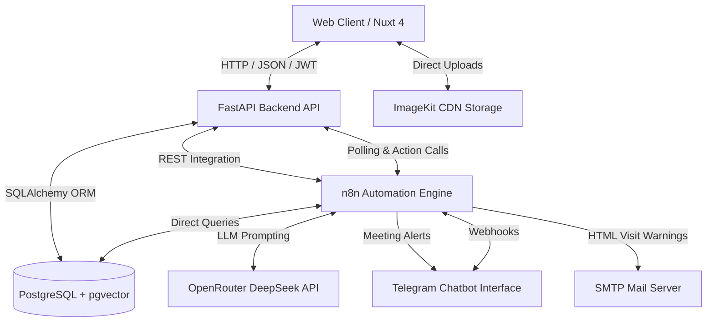
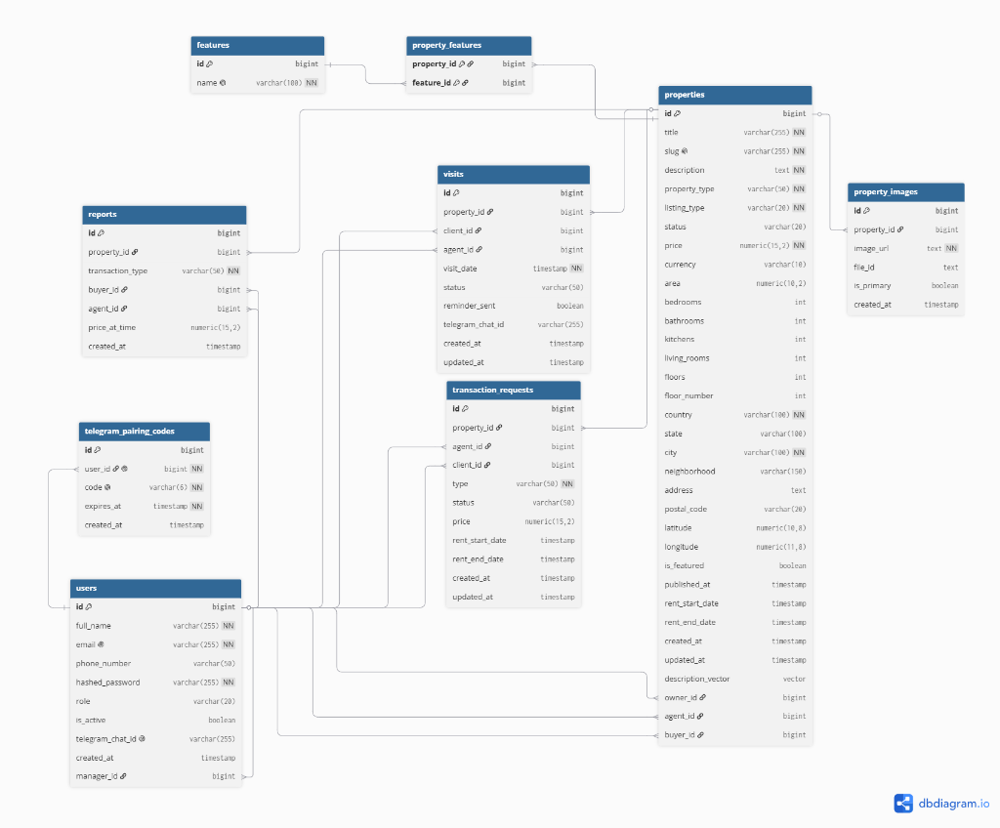

# Technical Documentation: Elite Estate System Architecture & Implementation

This document serves as the primary technical specification for the **Elite Estate** platform. It describes the system architecture, directory layouts, database schemas, security designs, and role-based workflows.

---

## 1. System Architecture Overview

Elite Estate is built as a micro-containerized system, isolating frontend, backend, database, and workflow automation services inside individual Docker containers.



### Components

1. **Frontend Portal (Nuxt 4 / Vue 3)**: A server-side rendered application styled with Tailwind CSS. It manages authentication sessions via Pinia and makes client-side calls to FastAPI.
2. **Backend Service (FastAPI / Python)**: A high-performance RESTful API using SQLAlchemy for database communication, Pydantic for request validation, and an internal encryption layer for user data privacy.
3. **Database Layer (PostgreSQL + pgvector)**: Houses platform-wide relational data, pairing code states, and 768-dimensional property description vector embeddings.
4. **Automation Engine (n8n)**: Self-hosted visual workflow tool coordinating conversational AI tools (interacting with DeepSeek-V4-Flash) and scheduled CRON scripts.
5. **Media Storage CDN (ImageKit.io)**: A cloud storage provider that serves optimized images for property listings.

---

## 2. Directory Structure

The project root is structured into self-contained service directories:

```text
real-estate-automation/
├── backend/                     # Python FastAPI Service
│   ├── main.py                  # API Entrypoint & Middleware Configuration
│   ├── models.py                # SQLAlchemy DB Schema Mapping
│   ├── schemas.py               # Pydantic Schemas for JSON Validation
│   ├── database.py              # Session & SQLAlchemy Connection Pooling
│   ├── routers/                 # Modular API Routes
│   │   ├── auth.py              # Login, Registration & Telegram Pairing
│   │   ├── properties.py        # CRUD Listings, Search, and RAG Q&A
│   │   ├── reports.py           # Transaction Reports & Downloads
│   │   ├── statistics.py        # Dashboard Analytics & Graphs
│   │   └── visits.py            # Scheduler, Overlaps, Agent Availability
│   ├── services/                # Third-party API Clients
│   │   ├── ai.py                # Gemini Embedding Engine & Semantic Search
│   │   ├── email.py             # SMTP Mailer Templates
│   │   └── storage.py           # ImageKit Client SDK Configuration
│   ├── utils/                   # Shared Helper Utilities
│   │   ├── reporting.py         # PDF Generator Engine
│   │   └── security.py          # JWT, Passwords & AES-256 Encryption
│   ├── Dockerfile               # Backend Container Definition
│   └── requirements.txt         # Backend Python Dependencies
│
├── frontend/                    # Nuxt 4 / Vue 3 Client Application
│   ├── app/                     # Source Directory
│   │   ├── assets/              # Design Tokens & Styles (main.css)
│   │   ├── components/          # Vue Component Library (agency, property, charts, ui)
│   │   ├── composables/         # Shared state handlers (useApi, useAlert)
│   │   ├── layouts/             # Master Templates (dashboard, default)
│   │   ├── pages/               # Routing (index, properties, login, admin, agent, agency)
│   │   ├── services/            # Custom API Service Wrappers
│   │   └── stores/              # Pinia Stores (auth.ts)
│   ├── package.json             # NPM package list
│   └── nuxt.config.ts           # Nuxt 4 Core Configuration File
│
├── n8n_workflows/               # JSON-Exported Production Workflows
│   ├── Elite Estate - Smart Agent service (6).json        # Telegram Bot RAG Assistant
│   └── Elite Estate - Meeting Reminder Service (9).json   # scheduled Cron Reminder
│
├── docs/                        # System Design and Maintenance Guides
└── docker-compose.yml           # Container Orchestration Engine
```

---

## 3. Database Schema Design

The relational database is built on PostgreSQL with the `pgvector` extension enabled.



### Table Definitions

#### 1. `users`
Persists accounts and user configurations.
* `id` (BigInteger, PK)
* `full_name` (String, Required)
* `email` (String, Unique, Indexed, Required)
* `phone_number` (String, Optional)
* `hashed_password` (String, Required)
* `role` (String, Default: "client") — `client`, `agent`, `head_agent`, `admin`
* `is_active` (Boolean, Default: true)
* `telegram_chat_id` (String, Unique, Optional) — **AES-256-CBC Encrypted**
* `manager_id` (BigInteger, FK -> `users.id`) — self-referencing hierarchy link
* `created_at` (Timestamp)

#### 2. `properties`
Stores real estate listings.
* `id` (BigInteger, PK)
* `title` (String, Required)
* `slug` (String, Unique, Indexed, Required)
* `description` (Text, Required)
* `property_type` (String, Required) — e.g. `apartment`, `villa`, `house`
* `listing_type` (String, Required) — `sale`, `rent`
* `status` (String, Default: "available") — `available`, `sold`, `rented`, `pending`
* `price` (Numeric(15,2), Required)
* `currency` (String, Default: "TND")
* `area` (Numeric(10,2))
* `bedrooms` / `bathrooms` / `kitchens` / `living_rooms` (Integer)
* `floors` / `floor_number` (Integer)
* `latitude` / `longitude` (Numeric) — coordinates for Leaflet maps
* `description_vector` (Vector(768), Optional) — 768-dimensional float array embedding
* `owner_id` (BigInteger, FK -> `users.id`)
* `agent_id` (BigInteger, FK -> `users.id`)
* `buyer_id` (BigInteger, FK -> `users.id`)
* `rent_start_date` / `rent_end_date` (Timestamp, Optional)

#### 3. `property_images`
Defines property galleries.
* `id` (BigInteger, PK)
* `property_id` (BigInteger, FK -> `properties.id`, ON DELETE CASCADE)
* `image_url` (String, Required)
* `file_id` (String) — ImageKit reference for file management
* `is_primary` (Boolean, Default: false)

#### 4. `features`
Global index of property features.
* `id` (BigInteger, PK)
* `name` (String, Unique, Required) — e.g., `Elevator`, `Pool`, `Garden`

#### 5. `property_features` (Join Table)
Associates properties with their amenities.
* `property_id` (BigInteger, FK -> `properties.id`, PK)
* `feature_id` (BigInteger, FK -> `features.id`, PK)

#### 6. `visits`
Tracks client viewings.
* `id` (BigInteger, PK)
* `property_id` (BigInteger, FK -> `properties.id`, Required)
* `client_id` (BigInteger, FK -> `users.id`, Optional) — populated on paired clients
* `agent_id` (BigInteger, FK -> `users.id`, Optional) — assigned sub-agent
* `visit_date` (Timestamp, Required)
* `status` (String, Default: "scheduled") — `scheduled`, `finished`, `cancelled`
* `reminder_sent` (Boolean, Default: false)
* `telegram_chat_id` (String, Optional) — **AES-256-CBC Encrypted**

#### 7. `telegram_pairing_codes`
Manages account-linking tokens.
* `id` (BigInteger, PK)
* `user_id` (BigInteger, FK -> `users.id`, Unique)
* `code` (String, Unique, Required) — 6-digit numeric string
* `expires_at` (Timestamp, Required)

#### 8. `reports`
Tracks contract closings.
* `id` (BigInteger, PK)
* `property_id` (BigInteger, FK -> `properties.id`, Required)
* `agent_id` (BigInteger, FK -> `users.id`) — agent closing the sale
* `buyer_id` (BigInteger, FK -> `users.id`)
* `price` (Numeric(15,2), Required)
* `deal_type` (String, Required) — `sale`, `rent`
* `rent_start_date` / `rent_end_date` (Timestamp, Optional)
* `status` (String, Default: "pending") — `pending`, `approved`, `rejected`
* `created_at` (Timestamp)

---

## 4. Security & Privacy Layer

### JWT Authentication
Access tokens are issued upon login (`POST /auth/login`) using **HMAC-SHA256**.
* Payload structures contain `sub` (user email), `id` (user primary key), `role`, and expiration (`exp`).
* Routes are protected using dependencies that fetch and validate the token from the HTTP `Authorization: Bearer <JWT>` header.

### Role-Based Access Control (RBAC)
Middleware checkers prevent unauthorized actions:
```python
def check_role(allowed_roles: list[str]):
    def dependency(user: UserModel = Depends(get_current_user)):
        if user.role not in allowed_roles:
            raise HTTPException(status_code=403, detail="Permission denied")
        return user
    return dependency
```

### Deterministic AES-256-CBC Encryption
To secure client Telegram accounts in compliance with personal privacy standards, we encrypt all `telegram_chat_id` values prior to DB entry.
* **Mechanism**: AES-256-CBC algorithm.
* **Key Derivation**: The encryption key is derived from the backend's `JWT_SECRET_KEY`.
* **Deterministic Initialization Vector (IV)**: The IV is derived deterministically from the chat ID itself. This guarantees that a given chat ID always generates the exact same ciphertext, permitting direct database lookups (`SELECT * FROM users WHERE telegram_chat_id = :encrypted_val`) without needing to decrypt the entire table.
* **Location**: Implemented in [backend/utils/security.py](file:///c:/Users/jesse/Desktop/study/iset_me/terminal/stage_pfe/real-estate-automation/real-estate-automation/backend/utils/security.py) as `encrypt_telegram_id()` and `decrypt_telegram_id()`.

---

## 5. System Workflows

### 5.1 Visitor Journey
* **Anonymous Browsing**: Visitors search properties on the homepage and dynamic browse feeds.
* **Property Search (Keyword)**: Queries use standard SQL `ilike` operations across the `/search/semantic` endpoint.
* **Account Creation**: Registration automatically grants the `client` role.

### 5.2 Client Journey
* **Fast Booking**: Logged-in clients select listing cards, view calendar availability, and book appointments.
* **Telegram Bot Pairing**: 
  1. Client generates a 6-digit pairing code on their profile dashboard.
  2. Clicking "Open Telegram Chat" launches a deep-link to the bot with the code pre-loaded.
  3. The chatbot pairs the profile, storing the encrypted ID.
  4. From that point on, they can converse, check listings, and schedule visits directly on Telegram.

### 5.3 Sub-Agent Journey
* **Assigned Inquiries**: Sub-Agents monitor client visits assigned to them through their custom dashboard.
* **Closing Transaction**: Sub-Agents mark viewings as "Finished". If the deal is successful, they submit a closing request (price, client ID, rent dates). This flags the listing status as `pending` and issues an email task to their Head Agent.

### 5.4 Head Agent Journey
* **Management & Oversight**: Head Agents review and assign property listings to their Sub-Agent team.
* **Advanced Team Calendar**: Visualizes all sub-agent schedules, highlighting overlaps.
* **Deals Review**: Approves or rejects closing requests. Approving a report modifies the property status to `sold` or `rented` and records a final transactional report.

### 5.5 Platform Administrator Journey
* **Global Access**: Administrators monitor global marketplace metrics and system reports.
* **User Management**: Administrators can activate/deactivate user accounts or promote staff members.
