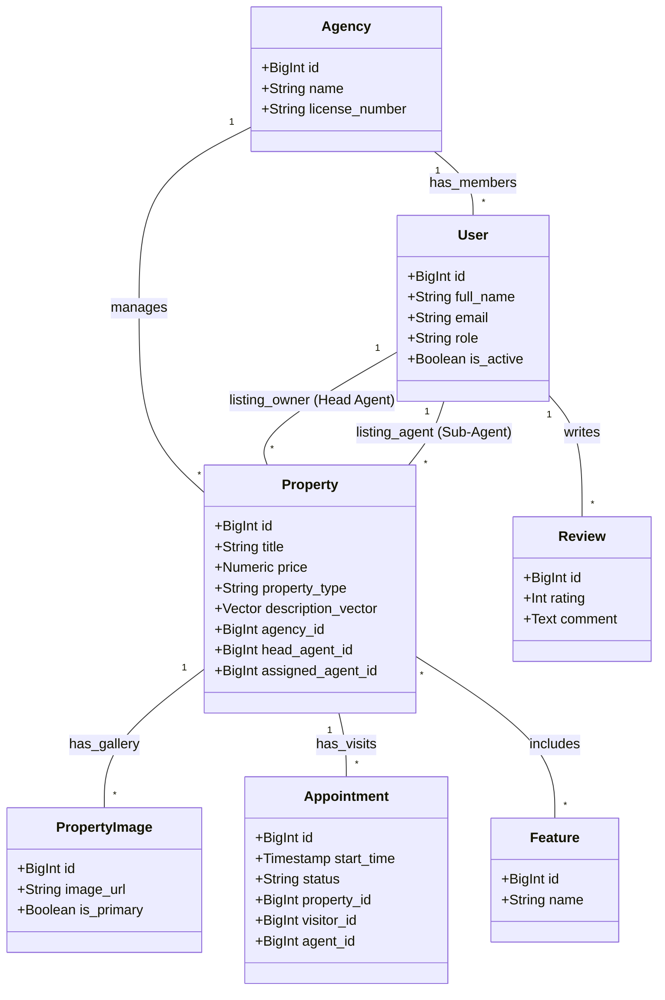

# UML Architecture Documentation

This document outlines the system architecture for the AI-Driven Real Estate Automation Platform using UML diagrams.

## 1. Use Case Diagram

```mermaid
useCaseDiagram
    actor "Visitor" as Visitor
    actor "Sub-Agent" as Agent
    actor "Head Agent" as Manager
    actor "Administrator" as Admin
    actor "System / AI" as AI
    actor "Telegram Bot" as Bot

    package "Property & Search" {
        usecase "Browse & Advanced Filtering" as UC1
        usecase "AI Semantic Search" as UC2
        usecase "View Property & Map" as UC3
        usecase "AI Assistant Inquiry (RAG)" as UC4A
    }

    package "Real Estate Operations" {
        usecase "List & Manage Properties (Upload Photos)" as UC6
        usecase "Manage Agency & Staff" as UC7
        usecase "Schedule & Confirm Visits" as UC8
    }

    Visitor --> UC1
    Visitor --> UC2
    Visitor --> UC3
    Visitor --> UC4A

    Agent --> UC8
    Agent --> UC8

    Manager --> UC6
    Manager --> UC7
    Manager --> UC8

    Admin --> UC1
    Admin --> UC3

    AI --> UC2
    
    Bot --> UC8
```

## 2. Class Diagram (Backend Models)



## 3. Workflow: Property Upload (Head Agent)
1. **Input**: Head Agent uploads property data and images.
2. **AI Action**: Gemini creates the embedding vector.
3. **Storage**: Data and Images are saved.


