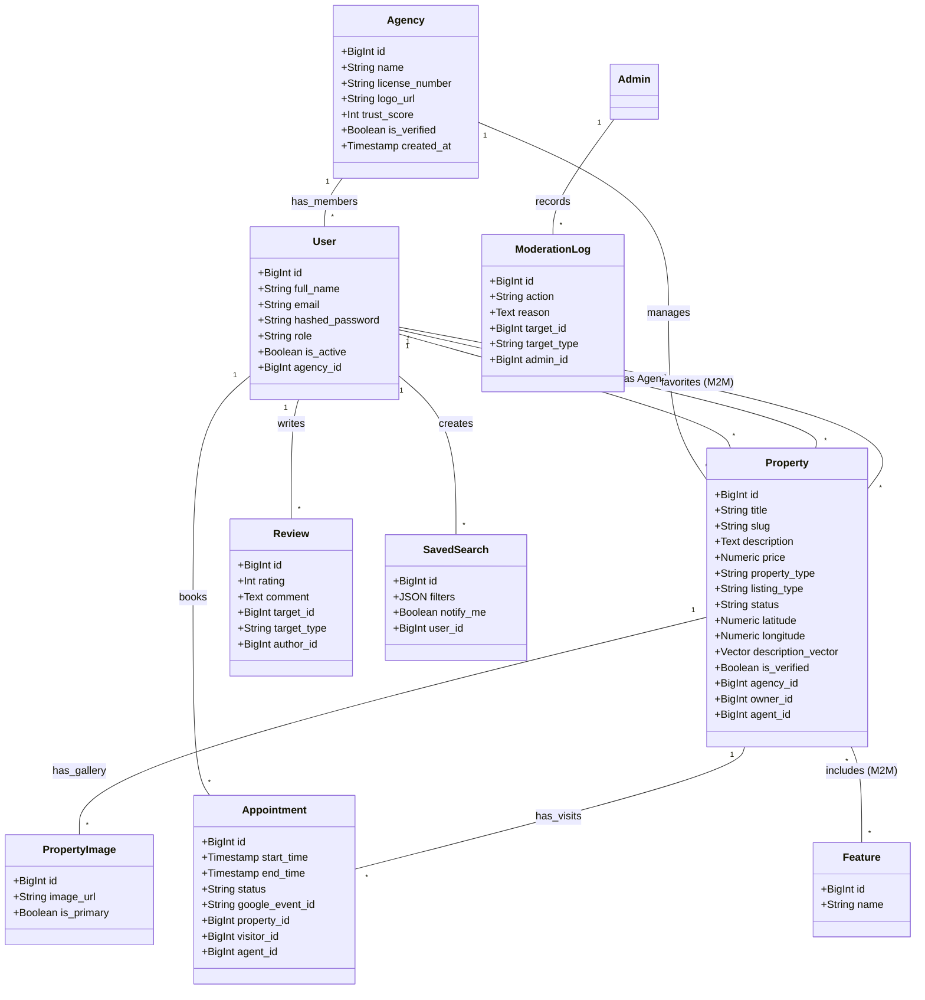
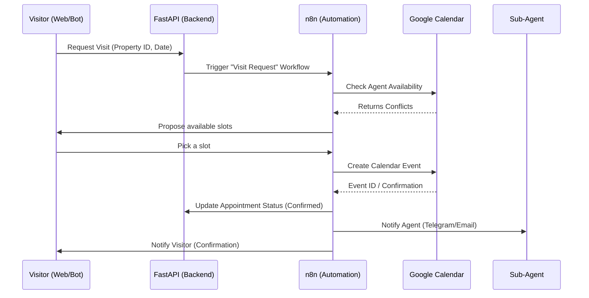

# Full Project UML Architecture Documentation

This document provides a comprehensive overview of the entire AI-Driven Real Estate Automation Platform architecture. It covers all existing features and planned modules.

---

## 1. Comprehensive Use Case Diagram

This diagram captures every major interaction within the ecosystem, including AI-driven automation and administrative control.

```mermaid
useCaseDiagram
    actor "Visitor" as Visitor
    actor "Sub-Agent" as Agent
    actor "Head Agent" as Manager
    actor "Administrator" as Admin
    actor "System / AI" as AI
    actor "Telegram Bot" as Bot

    package "Property & Search" {
        usecase "Browse & Advanced Filtering" as UC1
        usecase "AI Semantic Search" as UC2
        usecase "View Property & Map" as UC3
        usecase "Save Search & Notify Me" as UC4
        usecase "Manage Favorites" as UC5
    }

    package "Real Estate Operations" {
        usecase "List & Manage Properties" as UC6
        usecase "Manage Agency & Staff" as UC7
        usecase "Schedule & Confirm Visits" as UC8
        usecase "Respond to Inquiries" as UC9
    }

    package "Trust & Moderation" {
        usecase "Verify Listings & Agencies" as UC10
        usecase "Review & Rate Agents" as UC11
        usecase "AI Content Moderation" as UC12
        usecase "View Trust Score Analytics" as UC13
    }

    package "Automation & External" {
        usecase "Telegram Chatbot UI" as UC14
        usecase "Google Calendar Sync" as UC15
        usecase "Auto-generate Descriptions" as UC16
    }

    Visitor --> UC1
    Visitor --> UC2
    Visitor --> UC3
    Visitor --> UC4
    Visitor --> UC5
    Visitor --> UC11
    Visitor --> UC14

    Agent --> UC6
    Agent --> UC8
    Agent --> UC9

    Manager --> UC6
    Manager --> UC7
    Manager --> UC8
    Manager --> UC13

    Admin --> UC10
    Admin --> UC12

    AI --> UC2
    AI --> UC12
    AI --> UC16
    
    Bot --> UC14
    Bot --> UC15
```

---

## 2. Complete Class Diagram (Full System Scope)

This diagram shows all the data entities and how they are interconnected across the entire platform.



---

## 3. Core Workflow: Visit Scheduling (Sequence Diagram)

To clarify the "Automation" part of our project, here is how the data flows from a request to a Calendar entry.



---

## 4. Logical Components & Tech Stack

### Frontend (Nuxt.js)
- **Role**: Premium user interface, SEO-optimized landing pages, Map integration.
- **State**: Pinia for user state and favorites.

### Backend (FastAPI)
- **Role**: Core business logic, JWT Security, Semantic search indexing.
- **ORM**: SQLAlchemy with PostgreSQL + pgvector.

### AI Layer (Google Gemini)
- **Role**: Conversion of descriptions to vectors, automated content moderation, conversational RAG.

### Automation Layer (n8n)
- **Role**: "The Glue". Connects the database to external APIs (Telegram, Google Calendar, Email).
