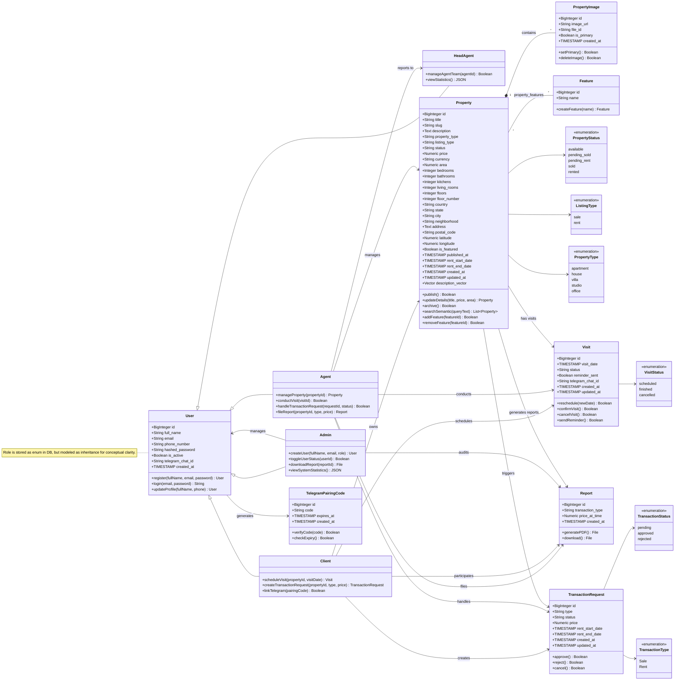

# UML Domain Class Diagram — Elite Estate (Conceptual Model)

This is the finalized, academic-grade UML Class Diagram representing the conceptual domain model of the Elite Estate platform.

## 📌 Modeling Decisions & Clarity Notes

* **UML Inheritance vs DB Schema**: While the database stores the user role as a string field (`client`, `agent`, `admin`, `head_agent`) for simplicity, it is modeled here as a class inheritance hierarchy to maintain clean conceptual design and structural clarity.
* **Role-Specific Class Relationships**: Associations are mapped directly to specific user subclasses (`Client`, `Agent`, `HeadAgent`, `Admin`) representing their exact domain roles, rather than using a generic, overly broad `User` class.
* **Association vs DB Schema**: Join tables and foreign key database attributes have been completely removed. Attributes represent strictly domain-level data, while relationships represent structural associations with clear multiplicity.
* **Strict Lifecycle Composition**: Only `PropertyImage` is bound to `Property` using Composition (`*--`), as images cannot exist without their parent property. All other dependencies are modeled as conceptual associations (`-->`).
* **Domain Methods**: Conceptual methods (representing business logic functions) have been added to the classes where they operate.

---

