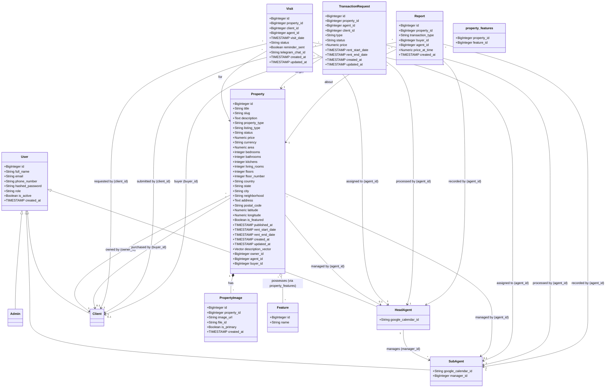

# Elite Estate Class Diagram

This class diagram outlines the data models and their relationships in the Elite Estate real estate automation project.

```mermaid
classDiagram
    %% Entities
    
    class User {
        +BigInteger id
        +String full_name
        +String email
        +String phone_number
        +String hashed_password
        +String role
        +Boolean is_active
        +TIMESTAMP created_at
    }

    class Admin {
        %% Specialized Admin methods/fields
    }

    class HeadAgent {
        +String google_calendar_id
    }

    class SubAgent {
        +String google_calendar_id
        +BigInteger manager_id
    }

    class Client {
        %% Specialized Client methods/fields
    }

    class Property {
        +BigInteger id
        +String title
        +String slug
        +Text description
        +String property_type
        +String listing_type
        +String status
        +Numeric price
        +String currency
        +Numeric area
        +Integer bedrooms
        +Integer bathrooms
        +Integer kitchens
        +Integer living_rooms
        +Integer floors
        +Integer floor_number
        +String country
        +String state
        +String city
        +String neighborhood
        +Text address
        +String postal_code
        +Numeric latitude
        +Numeric longitude
        +Boolean is_featured
        +TIMESTAMP published_at
        +TIMESTAMP rent_start_date
        +TIMESTAMP rent_end_date
        +TIMESTAMP created_at
        +TIMESTAMP updated_at
        +Vector description_vector
        +BigInteger owner_id
        +BigInteger agent_id
        +BigInteger buyer_id
    }

    class PropertyImage {
        +BigInteger id
        +BigInteger property_id
        +String image_url
        +String file_id
        +Boolean is_primary
        +TIMESTAMP created_at
    }

    class Feature {
        +BigInteger id
        +String name
    }

    class Visit {
        +BigInteger id
        +BigInteger property_id
        +BigInteger client_id
        +BigInteger agent_id
        +TIMESTAMP visit_date
        +String status
        +Boolean reminder_sent
        +String telegram_chat_id
        +TIMESTAMP created_at
        +TIMESTAMP updated_at
    }

    class Report {
        +BigInteger id
        +BigInteger property_id
        +String transaction_type
        +BigInteger buyer_id
        +BigInteger agent_id
        +Numeric price_at_time
        +TIMESTAMP created_at
    }

    class TransactionRequest {
        +BigInteger id
        +BigInteger property_id
        +BigInteger agent_id
        +BigInteger client_id
        +String type
        +String status
        +Numeric price
        +TIMESTAMP rent_start_date
        +TIMESTAMP rent_end_date
        +TIMESTAMP created_at
        +TIMESTAMP updated_at
    }

    class property_features {
        +BigInteger property_id
        +BigInteger feature_id
    }

    %% Inheritance
    User <|-- Admin
    User <|-- Client
    User <|-- HeadAgent
    User <|-- SubAgent

    %% Relationships
    HeadAgent "1" --> "*" SubAgent : manages (manager_id)
    Property "1" *-- "*" PropertyImage : has
    Property "*" o-- "*" Feature : possesses (via property_features)
    
    %% Property Associations
    Property "*" --> "1" Client : owned by (owner_id)
    Property "*" --> "0..1" HeadAgent : managed by (agent_id)
    Property "*" --> "0..1" SubAgent : managed by (agent_id)
    Property "*" --> "0..1" Client : purchased by (buyer_id)
    
    %% Visit Associations
    Visit "*" --> "1" Property : for
    Visit "*" --> "1" Client : requested by (client_id)
    Visit "*" --> "1" HeadAgent : assigned to (agent_id)
    Visit "*" --> "1" SubAgent : assigned to (agent_id)
    
    %% Transaction & Reporting
    TransactionRequest "*" --> "1" Property : target
    TransactionRequest "*" --> "1" Client : submitted by (client_id)
    TransactionRequest "*" --> "1" HeadAgent : processed by (agent_id)
    TransactionRequest "*" --> "1" SubAgent : processed by (agent_id)
    
    Report "*" --> "1" Property : about
    Report "*" --> "0..1" Client : buyer (buyer_id)
    Report "*" --> "1" HeadAgent : recorded by (agent_id)
    Report "*" --> "1" SubAgent : recorded by (agent_id)
```
