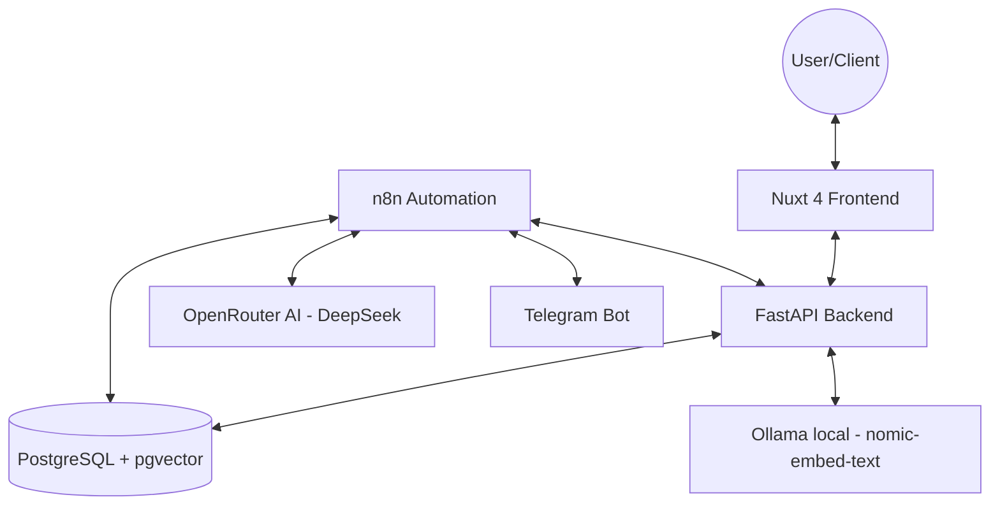

# Architecture Overview: Elite Estate

This document describes the high-level architecture and technology stack of the real estate automation system.

## 🏗 System Architecture

The project follows a **Containerized Micro-Architecture** approach, using Docker to isolate and connect multiple specialized services.



---

## 🛠 Technology Stack

### 1. Frontend (The Client Layer)
- **Type**: Full-stack Web Framework
- **Primary Tech**: [Nuxt 4](https://nuxt.com/) (Vue.js 3 / Nuxt 4 structure)
- **Language**: TypeScript/JavaScript
- **Styling**: Vanilla CSS (Premium design tokens)
- **Features**:
  - Server-Side Rendering (SSR) for SEO.
  - Interactive Property Browsing.
  - Integration with Backend APIs for Auth and Data.

### 2. Backend (The Logic Layer)
- **Type**: RESTful API Service (Modular Service-Router Pattern)
- **Primary Tech**: [FastAPI](https://fastapi.tiangolo.com/) (Python)
- **ORM**: SQLAlchemy
- **Database**: PostgreSQL
- **Key Features**:
  - JWT Authentication & Role-Based Access Control (RBAC).
  - RAG (Retrieval-Augmented Generation) pipeline for the AI Assistant.
  - Transactional reporting (Safe Plain-Text format).
  - Telegram Pairing with deterministic AES-256-CBC encryption of Chat IDs.

### 3. Database & Search
- **Relational Storage**: PostgreSQL
- **Semantic/Vector Search**: `pgvector` extension for storing and querying AI embeddings (used by n8n Smart Agent at `/search/rag`).
- **Keyword Search**: Standard SQL `ilike` filters (used by the web frontend at `/search/semantic` for high-performance listing filtering).
- **Cloud Storage**: ImageKit for property images and assets.
- **Data Security**: Encryption wrapper in `backend/utils/security.py` determinants-encrypts `telegram_chat_id` prior to DB insertions and queries.

### 4. Automation & Integration (The Workflow Layer)
- **Engine**: [n8n](https://n8n.io/) (Self-hosted)
- **Role**: Handles complex, asynchronous workflows:
  - **Visit Management**: Sub-agent assignment, visit creation in PostgreSQL database, and automated notifications.
  - **Telegram**: Intelligent bot service for leads and property inquiries.
  - **Notifications**: Emailing reports and alerts.

### 5. Artificial Intelligence
- **Models**: DeepSeek-V4-Flash (via OpenRouter) & Ollama (`nomic-embed-text` embeddings).
- **Capability**: Semantic search via vector matching (`pgvector`), intelligent chatbot interactions, and automated visit planning.

---

## 📂 Project Structure

```text
frontend/app/
├── 📂 assets/                      # Static resources
│   ├── 📂 images/                  # Project images & icons
│   └── 📄 main.css                 # Global styling & Design Tokens
├── 📂 components/                  # Component Library
│   ├── 📂 agency/                  # Head Agent Dashboard Components
│   │   ├── 📄 TeamCalendar.vue      # Full-team visit schedule
│   │   └── 📄 VisitDetailsModal.vue # Detailed client visit insights
│   ├── 📂 charts/                  # Data visualization
│   │   ├── 📄 BarChart.vue          # Productivity & Sales charts
│   │   └── 📄 DoughnutChart.vue     # Inventory breakdown charts
│   ├── 📂 property/                # Property-specific components
│   │   ├── 📄 Card.vue              # Primary property preview card
│   │   ├── 📄 Map.vue               # Interactive location display
│   │   ├── 📄 UploadModal.vue       # Main container for listing creation
│   │   └── 📂 sections/             # Modular form steps for property uploads
│   │       ├── 📄 AmenitiesSelector.vue # Feature selection (Pool, Garage, etc)
│   │       ├── 📄 BasicInfo.vue         # Title, description, and classification
│   │       ├── 📄 GalleryUpload.vue     # ImageKit multi-upload logic
│   │       ├── 📄 LocationPicker.vue    # Geographic data selection
│   │       └── 📄 Specs.vue             # Technical details (Area, Rooms, Floors)
│   └── 📂 ui/                      # Base interface elements
│       └── 📄 Navbar.vue            # Context-aware navigation bar
├── 📂 composables/                 # Reusable Business Logic
│   ├── 📄 useAlert.ts              # Global SweetAlert2 notification system
│   ├── 📄 useApi.ts                # Base API client with JWT support
│   ├── 📄 useAssetUrl.ts           # Media path & CDN resolver
│   └── 📄 usePropertyForm.ts       # Shared state for property creation
├── 📂 constants/                   # Static Configuration
│   └── 📄 location.ts              # Regional data (States/Cities) for Tunisia
├── 📂 layouts/                     # Master Templates
│   ├── 📄 dashboard.vue            # Private workspace layout (Sidebar + Header)
│   └── 📄 default.vue              # Public guest layout (Navbar + Footer)
├── 📂 pages/                       # Application Routing
│   ├── 📂 admin/                   # Platform Administration
│   │   └── 📄 index.vue            # User control, reports, and global analytics
│   ├── 📂 agency/                  # Head Agent Workspace
│   │   └── 📄 index.vue            # Team oversight & property control center
│   ├── 📂 agent/                   # Sub-Agent Workspace
│   │   └── 📄 index.vue            # Daily schedule & assigned listings
│   ├── 📂 dashboard/               # Client/Basic User Dashboard
│   │   ├── 📄 index.vue            # User overview & quick links
│   │   └── 📄 profile.vue          # User-specific dashboard settings
│   ├── 📂 properties/              # Marketplace Pages
│   │   ├── 📄 index.vue            # Advanced search & listing feed
│   │   └── 📄 [slug].vue           # Dynamic property detail page
│   ├── 📄 about.vue                # Company overview
│   ├── 📄 careers.vue              # Job opportunities page
│   ├── 📄 contact.vue              # Support & Inquiry contact
│   ├── 📄 index.vue                # Main Landing Page (Hero + Featured)
│   ├── 📄 login.vue                # Login authentication page
│   ├── 📄 profile.vue              # Public/General profile view
│   └── 📄 register.vue             # Account registration page
├── 📂 services/                    # Logic abstraction
│   └── 📄 propertyService.ts       # Specialized property API handlers
├── 📂 stores/                      # State Management (Pinia)
│   └── 📄 auth.ts                  # Global Auth store (Roles, User, Tokens)
├── 📄 app.vue                      # Application entry point
└── 📄 nuxt.config.ts               # Nuxt framework configuration


backend/
├── 📄 main.py              # Application entry point & Middleware configuration
├── 📄 models.py            # SQLAlchemy database models (PostgreSQL)
├── 📄 schemas.py           # Pydantic models (Data validation & Serialization)
├── 📄 auth.py              # Security utilities (JWT, Hashing, Role Checkers)
├── 📄 database.py          # SQLAlchemy engine & session configuration
├── 📂 routers/             # API Endpoints (Modular routing)
│   ├── 📄 auth.py          # Login, Register, and Session management
│   ├── 📄 properties.py    # CRUD for listings, AI search, and Agent assignment
│   ├── 📄 reports.py       # Transaction report retrieval & downloads
│   ├── 📄 statistics.py    # Dashboard KPI calculation logic
│   └── 📄 visits.py        # Visit scheduling & inquiry management
├── 📂 services/            # Third-Party Integrations & Core Logic
│   ├── 📄 ai.py            # Ollama Embeddings & Semantic Search logic
│   ├── 📄 email.py         # SMTP service (Alerts, Assignments, Rejections)
│   └── 📄 storage.py       # ImageKit SDK integration for cloud media
├── 📂 utils/               # Internal Helper Scripts
│   ├── 📄 reporting.py     # PDF Report generation (ReportLab)
│   ├── 📄 check_db.py      # Database connection validator
│   └── 📄 generate_sql.py  # Schema export utility
├── 📂 static/              # Static file hosting
│   ├── 📂 uploads/         # Local temporary storage for media
│   └── 📂 seed-images/     # Default images for database seeding
├── 📂 reports/             # Local storage for generated PDF reports
├── 📄 init_schema.sql      # Raw SQL for initial database setup
├── 📄 seed.py              # Data seeding script for development
├── 📄 requirements.txt     # Python dependency list
└── 📄 Dockerfile           # Containerization configuration

```

### Folder Breakdown

- **`backend/`**: Follows a modular **Service-Router** pattern.
  - **Routers**: Handle API routing and request/response validation. They match original paths exactly for parity.
  - **Services**: Encapsulate logic for third-party integrations (AI, Email, Storage).
  - **Core**: Contains models, schemas, and security engines.
- **`frontend/`**: The Nuxt 4 user interface, focusing on a premium property browsing experience with localized SSR.
- **`n8n_workflows/`**: Automation logic for database-driven visit scheduling, Telegram, and advanced reporting.
- **`docs/`**: Centralized documentation for setup, architecture, and AI logic.
- **`infrastructure/`**: Docker Compose configuration for multi-container orchestration.
