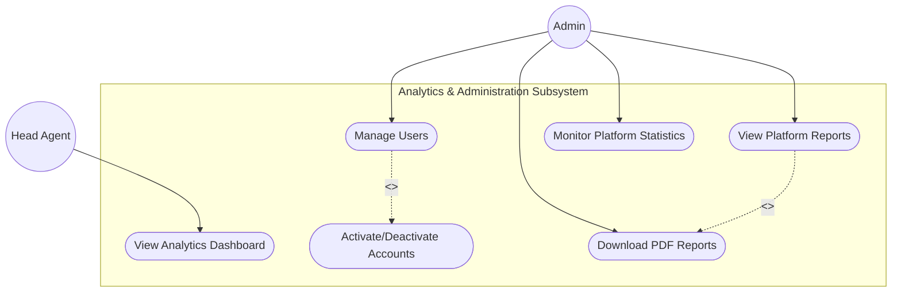
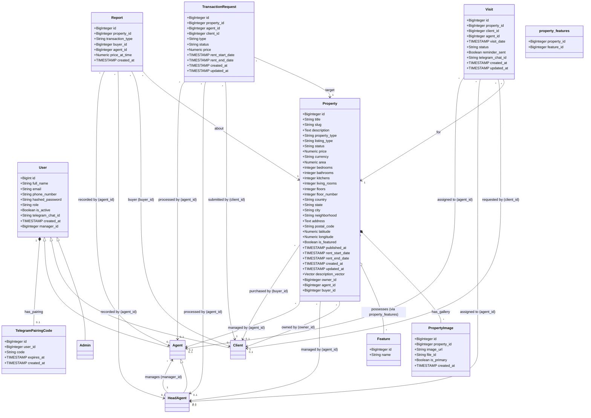

# UML Architecture Documentation

This document outlines the system architecture for the AI-Driven Real Estate Automation Platform using UML diagrams.

## 1. Use Case Diagrams (Subsystem Architecture)

To maintain maximum clarity, modularity, and readability for the final PFE academic report, the Elite Estate system's use cases are separated into **six specialized business subsystem diagrams**.

---

### Diagram 1: Global System Overview
Provides a bird's-eye view of all platform entry points, major domains, and base actor associations.

```mermaid
graph TD
    Visitor((Visitor))
    Client((Client))
    Agent((Agent))
    HeadAgent((Head Agent))
    Admin((Admin))

    %% Actor inheritance
    Client --|> Visitor
    HeadAgent --|> Agent

    subgraph Elite Estate Platform
        Auth[("Authentication & Authorization Subsystem")]
        Prop[("Property Management Subsystem")]
        Visit[("Visit Management Subsystem")]
        Trans[("Transaction Subsystem")]
        AdminSub[("Analytics & Administration Subsystem")]
    end

    Visitor --> Auth
    Visitor --> Prop

    Client --> Visit

    Agent --> Visit
    Agent --> Trans

    HeadAgent --> Prop
    HeadAgent --> AdminSub

    Admin --> AdminSub
    Admin --> Prop
```

---

### Diagram 2: Authentication & Authorization
Illustrates the user register/login operations and base verification layers.

```mermaid
graph TB
    Visitor((Visitor))
    Client((Client))
    Agent((Agent))
    HeadAgent((Head Agent))
    Admin((Admin))

    %% Generalization
    Client --|> Visitor
    HeadAgent --|> Agent

    subgraph Authentication & Authorization
        UC_Reg(["Register Account"])
        UC_Login(["Login to Platform"])
        UC_Logout(["Logout"])
        UC_JWT(["JWT Authentication"])
        UC_AuthZ(["Role Authorization"])
    end

    Visitor --> UC_Reg
    Visitor --> UC_Login

    Client --> UC_Logout
    Agent --> UC_Logout
    Admin --> UC_Logout

    UC_Login -. "<<include>>" .-> UC_JWT
    UC_Login -. "<<include>>" .-> UC_AuthZ
```

---

### Diagram 3: Property Management
Models creation, edits, features, and searching capabilities.

```mermaid
graph TB
    Visitor((Visitor))
    Client((Client))
    Agent((Agent))
    HeadAgent((Head Agent))
    Admin((Admin))

    %% Generalization
    Client --|> Visitor
    HeadAgent --|> Agent

    subgraph Property Management Subsystem
        UC_Browse(["Browse listings"])
        UC_Search(["Search properties"])
        UC_Semantic(["Semantic natural-language search"])
        UC_Details(["View property details & map"])
        UC_Create(["Create property listing"])
        UC_Edit(["Edit property listing"])
        UC_Delete(["Delete property listing"])
        UC_Assign(["Assign property to Agent"])
        UC_Upload(["Upload property images"])
        UC_Features(["Add amenities / features"])
    end

    %% Visitor and Client flows
    Visitor --> UC_Browse
    Visitor --> UC_Search
    Visitor --> UC_Details

    Client --> UC_Semantic

    %% Agent flows
    Agent --> UC_Details

    %% Head Agent flows
    HeadAgent --> UC_Create
    HeadAgent --> UC_Edit
    HeadAgent --> UC_Delete
    HeadAgent --> UC_Assign

    %% Admin flows
    Admin --> UC_Browse
    Admin --> UC_Details
    Admin --> UC_Delete

    %% Relationships
    UC_Create -. "<<include>>" .-> UC_Upload
    UC_Create -. "<<include>>" .-> UC_Features
    UC_Search -. "<<extend>>" .-> UC_Semantic
```

---

### Diagram 4: Visit Management
Outlines visit schedules, status transitions, and reminder automation.

```mermaid
graph TB
    Client((Client))
    Agent((Agent))
    HeadAgent((Head Agent))

    %% Generalization
    HeadAgent --|> Agent

    subgraph Visit Management Subsystem
        UC_Schedule(["Schedule Visit"])
        UC_ViewSchedule(["View Visit Schedule"])
        UC_UpdateStatus(["Update Visit Status"])
        UC_Cancel(["Cancel Visit"])
        UC_Complete(["Complete Visit"])
        UC_Reminder(["Send Visit Reminder"])
    end

    Client --> UC_Schedule
    Client --> UC_ViewSchedule

    Agent --> UC_ViewSchedule
    Agent --> UC_UpdateStatus

    UC_UpdateStatus -. "<<extend>>" .-> UC_Cancel
    UC_UpdateStatus -. "<<extend>>" .-> UC_Complete
    
    %% System automated interaction
    UC_Schedule -. "<<include>>" .-> UC_Reminder
```

---

### Diagram 5: Transaction System
Tracks requests, approvals, and report generations.

```mermaid
graph TB
    Client((Client))
    Agent((Agent))
    HeadAgent((Head Agent))
    Admin((Admin))

    %% Generalization
    HeadAgent --|> Agent

    subgraph Transaction Subsystem
        UC_ReqSale(["Request Sale"])
        UC_ReqRent(["Request Rent"])
        UC_Approve(["Approve Transaction"])
        UC_Reject(["Reject Transaction"])
        UC_GenReport(["Generate Transaction Report"])
        UC_DownPDF(["Download PDF Report"])
    end

    Client --> UC_ReqSale
    Client --> UC_ReqRent

    Agent --> UC_ReqSale
    Agent --> UC_ReqRent

    HeadAgent --> UC_Approve
    HeadAgent --> UC_Reject
    HeadAgent --> UC_GenReport

    Admin --> UC_DownPDF

    UC_Approve -. "<<include>>" .-> UC_GenReport
    UC_GenReport -. "<<include>>" .-> UC_DownPDF
```

---

### Diagram 6: Analytics & Administration
Provides comprehensive view into platform settings and KPI details.



---

## 2. Class Diagram (Backend Models)



## 3. Workflow: Property Upload (Head Agent)
1. **Input**: Head Agent uploads property data and images.
2. **AI Action**: Gemini creates the embedding vector.
3. **Storage**: Data and Images are saved.
