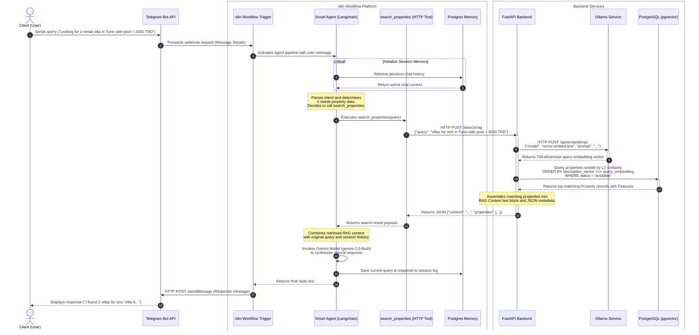

# Sequence Diagram — "Ask About Property" Functionality

This document details the sequence of interactions between the Client (User), Telegram, n8n Workflow Automation, the Langchain Smart Agent, the FastAPI Backend, Ollama (Vector Embedding Service), and PostgreSQL (pgvector Database) during a semantic property inquiry.

## 📌 Workflow Overview

1. **Inquiry Trigger**: The client interacts with the Telegram bot.
2. **Intent Parsing & Tool Calling**: The n8n Langchain Agent processes the query and decides to call the `search_properties` HTTP tool.
3. **Retrieval-Augmented Generation (RAG) Context Generation**:
   * The Backend requests a vector representation of the query from Ollama.
   * The Backend searches PostgreSQL using pgvector cosine/L2-distance similarity.
   * Relevant property details are assembled into a context payload.
4. **Response Generation**: The Smart Agent uses Gemini LLM to synthesize a natural language response based on the retrieved context.
5. **Dispatch**: The response is sent back to the client via Telegram.

---

## 🛠️ Key Execution Steps

* **Vector Embedding Injection**: The FastAPI Backend transforms the natural language text into a machine-readable vector via Ollama's `nomic-embed-text` model.
* **Semantic Retrieval**: Rather than standard keyword searching, PostgreSQL employs vector distance calculation (`l2_distance` or `<=>`) directly on the `description_vector` column to identify properties matching the conceptual query.
* **Contextual Grounding**: By injecting the matching property facts into the Gemini prompt context, the Smart Agent generates factual, hallucination-free property information with direct contact options.
