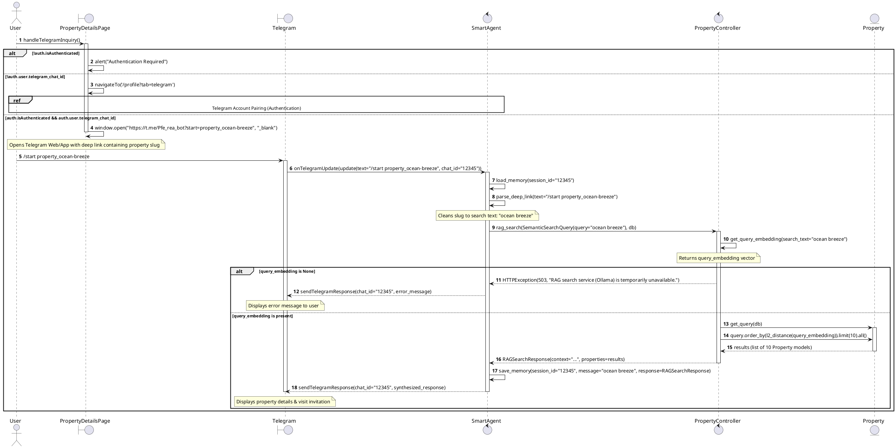

# Sequence Diagram — "Ask About Property" Functionality

This document details the sequence of interactions between the User, the Property Details Page, the Telegram Bot UI, n8n Workflow automation (Smart Agent), the FastAPI Backend (Property Controller), and the PostgreSQL Database (Property Entity) during a semantic property inquiry using n8n and LangChain RAG.

## 📌 Workflow Overview

1. **Deep Link Generation**: 
   - The User clicks "Inquire via Telegram" on the [properties/[slug].vue](file:///c:/Users/jesse/Desktop/study/iset_me/terminal/stage_pfe/real-estate-automation/real-estate-automation/frontend/app/pages/properties/[slug].vue) details page.
   - The page checks if the User is authenticated and has a linked Telegram account.
   - If not authenticated, it alerts the user. If authenticated but lacking a linked account, it triggers the **Telegram Account Pairing** authentication flow.
   - If valid, it redirects the User using a deep link URL pointing to the Telegram bot with the property slug context: `https://t.me/Pfe_rea_bot?start={slug}`.
2. **Bot Invocation**:
   - The User launches the bot on Telegram with `/start property_{slug}`.
   - Telegram sends the webhook payload to the n8n `Telegram Trigger`.
3. **Intent Parsing & Tool Calling**:
   - The `Smart Agent` (n8n LangChain Agent) loads conversation history from memory.
   - It extracts the slug context, formats it into a search phrase (replacing hyphens with spaces), and decides to invoke the `search_properties` HTTP tool.
4. **Semantic Search & RAG Context Retrieval**:
   - The `search_properties` tool executes a POST request calling `rag_search(payload, db)` on the FastAPI backend [backend/routers/properties.py](file:///c:/Users/jesse/Desktop/study/iset_me/terminal/stage_pfe/real-estate-automation/real-estate-automation/backend/routers/properties.py).
   - The controller generates the search query embedding vector by calling `get_query_embedding(search_text)` in [backend/services/ai.py](file:///c:/Users/jesse/Desktop/study/iset_me/terminal/stage_pfe/real-estate-automation/real-estate-automation/backend/services/ai.py).
   - The controller queries the database using `PropertyRepository.get_query(db)` in [backend/repositories/property_repository.py](file:///c:/Users/jesse/Desktop/study/iset_me/terminal/stage_pfe/real-estate-automation/real-estate-automation/backend/repositories/property_repository.py).
   - It performs vector sorting using pgvector L2-distance (`l2_distance`) and retrieves matching properties (`limit(10).all()`).
5. **Response Synthesis**:
   - The backend returns the list of matching properties and context to the tool.
   - The `Smart Agent` synthesizes a natural response utilizing the context details and posts it back to the client via Telegram.

---

## 📊 Mermaid Representation

```mermaid
sequenceDiagram
    autonumber
    actor ActorUser as User
    participant PropertyDetailsPage as PropertyDetailsPage ([slug].vue)
    participant Telegram as Telegram
    participant SmartAgent as SmartAgent (n8n)
    participant PropertyController as PropertyController (FastAPI)
    participant Property as Property (DB/Repo)

    ActorUser->>PropertyDetailsPage: handleTelegramInquiry()
    activate PropertyDetailsPage
    
    alt !auth.isAuthenticated
        PropertyDetailsPage->>PropertyDetailsPage: alert("Authentication Required")
    else !auth.user.telegram_chat_id
        PropertyDetailsPage->>PropertyDetailsPage: navigateTo('/profile?tab=telegram')
        Note over ActorUser, PropertyDetailsPage, Telegram, SmartAgent: Telegram Account Pairing (Authentication)
    else auth.isAuthenticated && auth.user.telegram_chat_id
        PropertyDetailsPage->>PropertyDetailsPage: window.open("https://t.me/Pfe_rea_bot?start=property_ocean-breeze", "_blank")
        Note over PropertyDetailsPage: Opens Telegram Web/App with deep link containing property slug
        deactivate PropertyDetailsPage
        
        ActorUser->>Telegram: /start property_ocean-breeze
        activate Telegram
        Telegram->>SmartAgent: onTelegramUpdate(update(text="/start property_ocean-breeze", chat_id="12345"))
        activate SmartAgent
        
        SmartAgent->>SmartAgent: load_memory(session_id="12345")
        SmartAgent->>SmartAgent: parse_deep_link(text="/start property_ocean-breeze")
        Note over SmartAgent: Cleans slug to search text: "ocean breeze"
        
        SmartAgent->>PropertyController: rag_search(SemanticSearchQuery(query="ocean breeze"), db)
        activate PropertyController
        
        PropertyController->>PropertyController: get_query_embedding(search_text="ocean breeze")
        Note over PropertyController: Returns query_embedding vector
        
        alt query_embedding is None
            PropertyController-->>SmartAgent: HTTPException(503, "RAG search service (Ollama) is temporarily unavailable.")
            SmartAgent-->>Telegram: sendTelegramResponse(chat_id="12345", error_message)
            Note over Telegram: Displays error message to user
        else query_embedding is present
            PropertyController->>Property: get_query(db)
            activate Property
            PropertyController->>Property: query.order_by(l2_distance(query_embedding)).limit(10).all()
            Property-->>PropertyController: results (list of 10 Property models)
            deactivate Property
            
            PropertyController-->>SmartAgent: RAGSearchResponse(context="...", properties=results)
            deactivate PropertyController
            
            SmartAgent->>SmartAgent: save_memory(session_id="12345", message="ocean breeze", response=RAGSearchResponse)
            SmartAgent-->>Telegram: sendTelegramResponse(chat_id="12345", synthesized_response)
            deactivate SmartAgent
            
            Note over Telegram: Displays property details & visit invitation
            deactivate Telegram
        end
    end
```

---

## 📊 PlantUML Representation

To render this diagram using PlantUML, you can use the code below:



---

## 🛠️ Key Implementation Details

* **Telegram Deep Linking**: Located inside [properties/[slug].vue](file:///c:/Users/jesse/Desktop/study/iset_me/terminal/stage_pfe/real-estate-automation/real-estate-automation/frontend/app/pages/properties/[slug].vue#L189-L209), `handleTelegramInquiry()` verifies client authentication and checks for a paired Telegram chat ID. It opens `https://t.me/{botUsername}?start={slug}` to pass the property context as a deep link.
* **LangChain n8n Automation**: Defined in [Elite Estate - Smart Agent service.json](file:///c:/Users/jesse/Desktop/study/iset_me/terminal/stage_pfe/real-estate-automation/real-estate-automation/n8n_workflows/Elite%20Estate%20-%20Smart%20Agent%20service.json), the trigger node parses incoming Telegram `/start` commands, extracts the slug, cleans it into a property title query, and calls the `search_properties` node (representing tool invocation).
* **RAG Semantic Search Router**: FastAPI endpoint `rag_search(payload, db)` in [backend/routers/properties.py](file:///c:/Users/jesse/Desktop/study/iset_me/terminal/stage_pfe/real-estate-automation/real-estate-automation/backend/routers/properties.py#L405-L465) maps to `/search/rag`. It receives the natural search query from n8n.
* **Embedding & Similarity Queries**: The controller requests embeddings from the Ollama service via `ai.get_query_embedding(search_text)` in [backend/services/ai.py](file:///c:/Users/jesse/Desktop/study/iset_me/terminal/stage_pfe/real-estate-automation/real-estate-automation/backend/services/ai.py#L26-L28). Then, it queries `PropertyRepository.get_query(db)` in [backend/repositories/property_repository.py](file:///c:/Users/jesse/Desktop/study/iset_me/terminal/stage_pfe/real-estate-automation/real-estate-automation/backend/repositories/property_repository.py#L119-L121) and sorts results based on vector distance: `.order_by(models.Property.description_vector.l2_distance(query_embedding))`.
