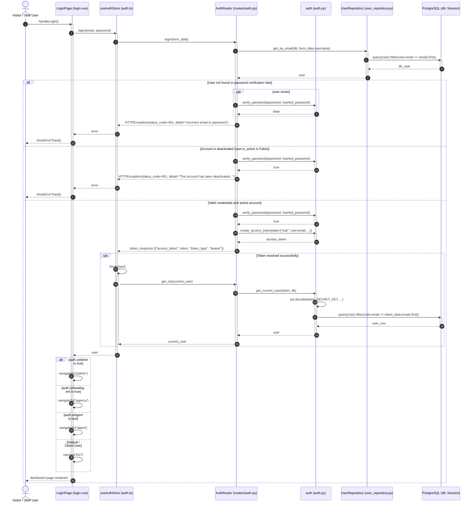
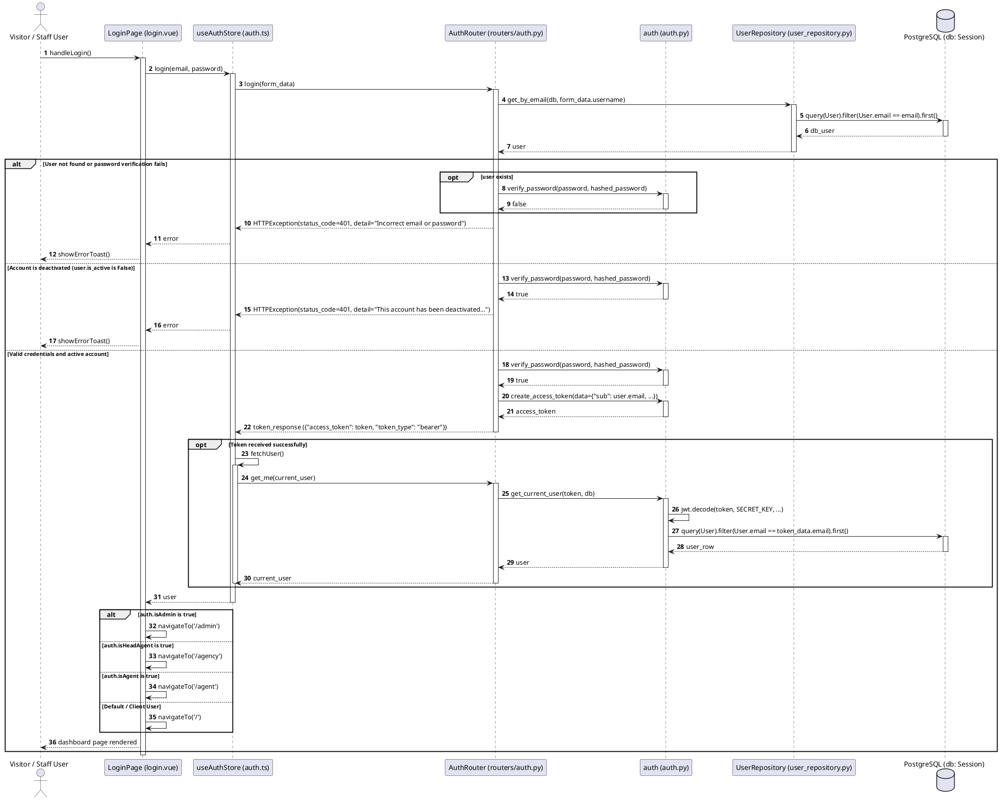

# Sequence Diagram — User Login

This document details the sequence of interactions between the Visitor/Staff Client, the NuxtJS Frontend, the Pinia Auth Store, the FastAPI Backend, the authentication security module, and the PostgreSQL database during the user login flow.

## 📌 Workflow Overview

1. **User Action**: The user fills in credentials and clicks "Sign In", triggering the form submit handler.
2. **State Store Action**: The frontend Pinia store formats credentials and makes an async HTTP POST request to the login endpoint.
3. **Credentials Lookup & Verification**: 
   - The backend retrieves the user via the `UserRepository`.
   - The password hash is verified using `pwd_context` helpers.
   - The account status (`is_active`) is verified.
4. **Token Generation**: A JWT access token containing the sub (email), role, and user ID is generated and returned to the client.
5. **Session Bootstrap**: The store persists the token in local storage, executes an async call to retrieve user profile data, and navigates the user to their role-specific dashboard.

---

---

## 📊 PlantUML Representation

To render this diagram using PlantUML, you can use the code below:

---

## 🛠️ Key Implementation Details

* **Router Mapping**: The frontend Axios client POST request routes directly to the `login()` endpoint defined in `backend/routers/auth.py`.
* **Repository Hook**: `UserRepository.get_by_email` uses the SQLAlchemy session to query the DB directly, returning a Python `models.User` object mapping the `users` table.
* **Encryption Context**: Password validation uses `pwd_context.verify` in the `auth` module, abstracting password hashing (`pbkdf2_sha256`).
* **Active Check**: Even with valid credentials, `is_active` must be `True` to authorize login, preventing disabled agents/staff from accessing the application.
* **Profile Sync**: Upon login, the store calls `fetchUser()` which queries `auth/me` to secure the complete user model (`current_user`) for store context before redirecting.
