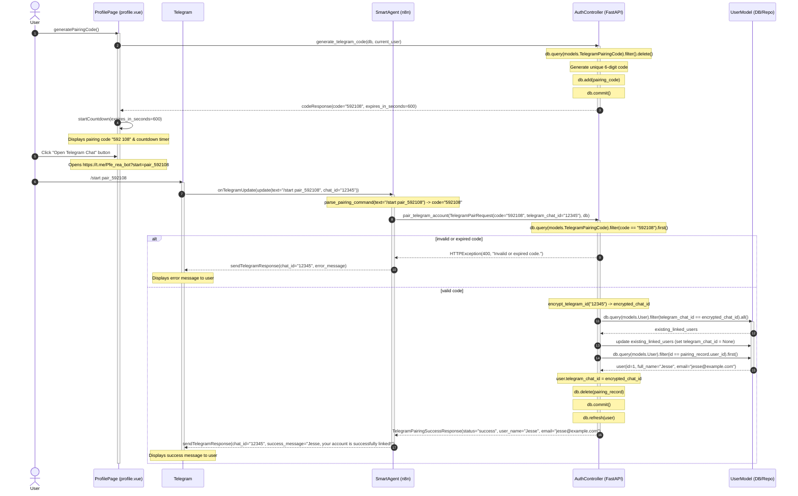
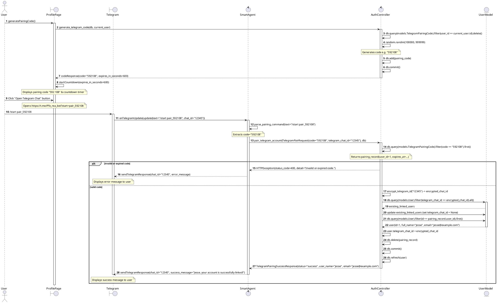

# Sequence Diagram — Telegram Account Pairing (Authentication)

This document details the sequence of interactions for secure Telegram account pairing. This process maps a logged-in user's web account to their Telegram profile using a temporary 6-digit verification code, allowing the AI smart agent to recognize the client's identity for RAG search and visit bookings.

## 📌 Workflow Overview

1. **Verification Code Generation**:
   - The user requests a pairing code from the Profile page.
   - The backend deletes any obsolete pairing codes for the user, generates a secure 6-digit random code, saves it with a 10-minute expiration, and returns it.
2. **Deep Link Handoff**:
   - The Profile page starts a countdown timer and displays the code.
   - When the user clicks "Open Telegram Chat", the frontend opens a Telegram deep link formatting the start parameter: `/start pair_<code>`.
3. **Identity Verification & Mapping**:
   - The Telegram bot receives the `/start` command containing the code and triggers the n8n Smart Agent workflow.
   - The Smart Agent parses the code and sends it with the Telegram Chat ID to the FastAPI `/auth/telegram/pair` endpoint.
   - The backend validates the code and links the `telegram_chat_id` to the matching `UserModel`. It also safeguards uniqueness by resetting any existing user records using this ID.
   - Once success is confirmed, n8n replies to the user on Telegram confirming the link.

---

## 📊 Mermaid Representation

---

## 📊 PlantUML Representation

To render this diagram using PlantUML, you can use the code below:

---

## 🛠️ Key Implementation Details

* **Frontend Pairing Page**: Located in [profile.vue](file:///c:/Users/jesse/Desktop/study/iset_me/terminal/stage_pfe/real-estate-automation/real-estate-automation/frontend/app/pages/profile.vue#L81-L190). The button executes `generatePairingCode()` to fetch a code from the backend and launches a countdown timer tracking the lifespan of the pairing token.
* **Backend Verification Endpoint**: Found in [backend/routers/auth.py](file:///c:/Users/jesse/Desktop/study/iset_me/terminal/stage_pfe/real-estate-automation/real-estate-automation/backend/routers/auth.py#L216-L285). The `/auth/telegram/generate-code` endpoint issues new pairing records while unlinking stale credentials. The `/auth/telegram/pair` verifies code parity, ensures single-client mapping consistency, and registers the telegram handle to the client's `UserModel`.
