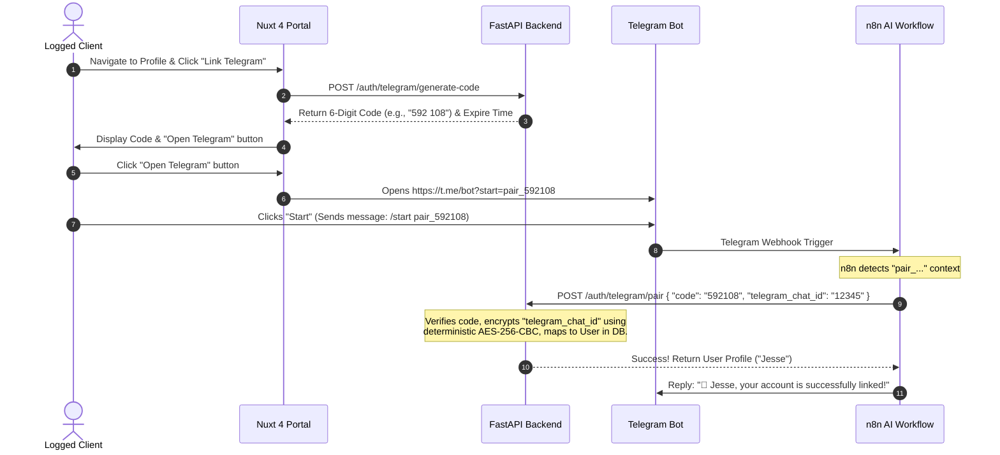

# System Design: Telegram & Web Account Secure Pairing (Option A)

This document provides the full technical specification and architectural blueprint for implementing **Option A** (Secure Pairing Code). This will seamlessly link a user's web account to their Telegram presence, allowing the AI agent to know exactly who is chatting and book visits under their real database `client_id`.

---

## 🔗 How It Works: The 5-Step Flow



---

## 1. Database Schema Changes

To persist linked Telegram accounts and handle the pairing process, we:
1. Added a `telegram_chat_id` column to the `users` table. Since this contains sensitive PII, it is encrypted in the database.
2. Created a temporary pairing codes table (`telegram_pairing_codes`) to hold active codes.

### Migration SQL
```sql
-- 1. Add column to users (encrypted value)
ALTER TABLE users ADD COLUMN telegram_chat_id VARCHAR(255) UNIQUE NULL;

-- 2. Create pairing codes table
CREATE TABLE telegram_pairing_codes (
    id SERIAL PRIMARY KEY,
    user_id BIGINT REFERENCES users(id) ON DELETE CASCADE,
    code VARCHAR(6) UNIQUE NOT NULL,
    expires_at TIMESTAMP WITHOUT TIME ZONE NOT NULL,
    created_at TIMESTAMP WITHOUT TIME ZONE DEFAULT CURRENT_TIMESTAMP
);
```

---

## 2. FastAPI Backend Endpoints

The system exposes pairing endpoints in `backend/routers/auth.py` and uses security helper utilities to encrypt the identifiers before they touch PostgreSQL.

### A. Endpoint 1: Generate Code (Called by Web Frontend)
Generates a random 6-digit code, cleans up previous entries for the user, stores it with a 10-minute expiration, and returns it to the client.

```python
@router.post("/auth/telegram/generate-code")
def generate_telegram_code(
    db: Session = Depends(database.get_db),
    current_user: models.User = Depends(auth.get_current_user)
):
    import random
    from datetime import datetime, timedelta

    # Delete any existing pairing code for this user
    db.query(models.TelegramPairingCode).filter(models.TelegramPairingCode.user_id == current_user.id).delete()
    
    # Generate unique 6-digit code
    code = f"{random.randint(100000, 999999)}"
    while db.query(models.TelegramPairingCode).filter(models.TelegramPairingCode.code == code).first():
        code = f"{random.randint(100000, 999999)}"
        
    expires_at = datetime.utcnow() + timedelta(minutes=10)
    pairing_code = models.TelegramPairingCode(
        user_id=current_user.id,
        code=code,
        expires_at=expires_at
    )
    
    db.add(pairing_code)
    db.commit()
    
    return {
        "code": code,
        "expires_in_seconds": 600
    }
```

### B. Endpoint 2: Link Accounts (Called by n8n Bot)
Cleans the code (handles `/start pair_XXXXXX` and whitespace), encrypts the incoming `telegram_chat_id` using deterministic AES-256-CBC, unlinks any stale records mapping to that ID, and registers it to the user.

```python
@router.post("/auth/telegram/pair", response_model=schemas.TelegramPairingSuccessResponse)
def pair_telegram_account(
    payload: schemas.TelegramPairRequest,
    db: Session = Depends(database.get_db)
):
    from datetime import datetime
    import re

    # Clean the pairing code from possible /start commands
    clean_code = payload.code.strip()
    if "pair_" in clean_code:
        clean_code = clean_code.split("pair_")[-1].strip()
    
    digits_match = re.search(r'\d{6}', clean_code)
    if digits_match:
        clean_code = digits_match.group(0)
    else:
        clean_code = payload.code

    # Deterministic AES-256-CBC Encryption (Allows direct indexed query lookup)
    encrypted_chat_id = encrypt_telegram_id(payload.telegram_chat_id)

    pairing_record = db.query(models.TelegramPairingCode).filter(models.TelegramPairingCode.code == clean_code).first()
    if not pairing_record:
        # Check if already paired to allow safe retries
        existing_user = db.query(models.User).filter(models.User.telegram_chat_id == encrypted_chat_id).first()
        if existing_user:
            return {"status": "success", "user_name": existing_user.full_name, "email": existing_user.email}
        raise HTTPException(status_code=400, detail="Invalid pairing code.")
        
    if pairing_record.expires_at < datetime.utcnow():
        db.delete(pairing_record)
        db.commit()
        existing_user = db.query(models.User).filter(models.User.telegram_chat_id == encrypted_chat_id).first()
        if existing_user:
            return {"status": "success", "user_name": existing_user.full_name, "email": existing_user.email}
        raise HTTPException(status_code=400, detail="Pairing code has expired.")
        
    user = db.query(models.User).filter(models.User.id == pairing_record.user_id).first()
    if not user:
        raise HTTPException(status_code=404, detail="User associated with code not found.")
        
    # Prevent duplication by clearing out old associations of this Telegram ID
    existing_linked_users = db.query(models.User).filter(models.User.telegram_chat_id == encrypted_chat_id).all()
    for elu in existing_linked_users:
        elu.telegram_chat_id = None
        
    user.telegram_chat_id = encrypted_chat_id
    db.delete(pairing_record)
    db.commit()
    db.refresh(user)
    
    return {
        "status": "success",
        "user_name": user.full_name,
        "email": user.email
    }
```

### C. Updated Booking Route (`backend/routers/visits.py`)
Now that the `telegram_chat_id` is linked to the user, the AI agent can simply pass the ID, and the backend automatically resolves the correct `client_id` in the database!

```python
@router.post("/visits/book", response_model=schemas.VisitResponse)
def book_visit(
    payload: schemas.VisitCreate,
    db: Session = Depends(database.get_db)
):
    visit_date_utc = payload.visit_date.astimezone(timezone.utc)
    
    # NEW IDENTITY RESOLUTION:
    # Query the user database to find the user that matches this Telegram Chat ID!
    user = db.query(models.User).filter(
        models.User.telegram_chat_id == payload.client_telegram_id
    ).first()
    
    # If a user is found, link the client_id! Otherwise, fall back to None (Visitor).
    client_id = user.id if user else None
    
    new_visit = models.Visit(
        property_id=payload.property_id,
        client_id=client_id, # Safely resolved!
        agent_id=payload.agent_id,
        visit_date=visit_date_utc,
        telegram_chat_id=payload.client_telegram_id,
        status="scheduled",
        reminder_sent=False
    )
    return VisitRepository.save(db, new_visit)
```

---

## 3. Frontend UI Design (Nuxt 4)

In the user's dashboard profile (`profile.vue`), we will replace or add a dedicated **"Telegram Connection Status"** card.

### Sleek Card Mockup (Tailwind + CSS)
```vue
<template>
  <div class="card-premium p-8 border border-primary-100">
    <div class="flex items-start justify-between mb-6">
      <div>
        <h3 class="text-xl font-bold text-primary-950">Telegram Integration</h3>
        <p class="text-sm text-primary-500 mt-1">Receive booking alerts and talk directly with our AI agent.</p>
      </div>
      <div 
        :class="[
          'px-3 py-1 text-xs font-bold rounded-full flex items-center gap-1.5',
          auth.user.telegram_chat_id ? 'bg-green-50 text-green-700' : 'bg-amber-50 text-amber-700'
        ]"
      >
        <span class="w-1.5 h-1.5 rounded-full" :class="auth.user.telegram_chat_id ? 'bg-green-500' : 'bg-amber-500'"></span>
        {{ auth.user.telegram_chat_id ? 'Linked' : 'Not Connected' }}
      </div>
    </div>

    <!-- Active State: User already connected -->
    <div v-if="auth.user.telegram_chat_id" class="flex items-center justify-between p-4 bg-primary-50 rounded-2xl">
      <div class="flex items-center gap-3">
        <div class="w-10 h-10 bg-[#229ED9]/10 rounded-xl flex items-center justify-center text-[#229ED9]">
          <LucideSend class="w-5 h-5" />
        </div>
        <div>
          <p class="text-sm font-bold text-primary-950">Connected Telegram Account</p>
          <p class="text-xs text-primary-500">ID: {{ auth.user.telegram_chat_id }}</p>
        </div>
      </div>
      <button @click="disconnectTelegram" class="text-xs font-bold text-red-600 hover:text-red-700 transition-colors">
        Disconnect
      </button>
    </div>

    <!-- Disconnected State: Show setup button -->
    <div v-else class="space-y-6">
      <div v-if="!pairingCode" class="flex justify-start">
        <button @click="generateCode" class="btn-primary flex items-center gap-2 py-3">
          <LucideSend class="w-4 h-4" /> Link Your Telegram Bot
        </button>
      </div>

      <!-- Pairing Mode: Displays 6-digit code -->
      <div v-else class="space-y-4 p-6 bg-primary-50/50 border border-dashed border-primary-200 rounded-2xl text-center">
        <p class="text-sm text-primary-600">Send this pairing code to the chatbot to link your account:</p>
        
        <div class="text-3xl font-extrabold tracking-[0.3em] text-primary-950 font-mono py-2">
          {{ pairingCode.slice(0, 3) }} {{ pairingCode.slice(3) }}
        </div>
        
        <p class="text-xs text-primary-400">Code expires in 10 minutes</p>
        
        <div class="flex justify-center gap-3 mt-4">
          <button @click="openTelegramLink" class="px-5 py-2.5 bg-[#229ED9] hover:bg-[#1E8CC0] text-white font-bold rounded-xl text-sm transition-all flex items-center gap-2">
            Open Telegram Chat
          </button>
          <button @click="pairingCode = null" class="text-xs text-primary-400 hover:text-primary-600 font-bold transition-colors">
            Cancel
          </button>
        </div>
      </div>
    </div>
  </div>
</template>
```

---

## 4. n8n Bot /start Handler Customization

When the client clicks the **"Open Telegram Chat"** button:
- The browser opens: `https://t.me/Pfe_rea_bot?start=pair_592108`
- Telegram sends a start message: `/start pair_592108`
- In the n8n bot triggers, we add a conditional node:

```javascript
// n8n Javascript node to parse command
const text = items[0].json.message.text;

if (text.startsWith('/start pair_')) {
    const code = text.replace('/start pair_', '').trim();
    return {
        action: "pair_account",
        code: code,
        telegram_chat_id: items[0].json.message.chat.id
    };
}
```

If it matches `pair_account`:
1. n8n invokes the FastAPI endpoint: `POST /auth/telegram/pair` passing the `code` and the `telegram_chat_id`.
2. On success, the API returns the user's name (e.g., `"Jesse"`).
3. The n8n Telegram Bot node immediately replies to the client on Telegram:
   > *"🎉 Congratulations, **Jesse**! Your Elite Estate web account has been successfully linked to your Telegram profile. You can now seamlessly book property visits!"*

---

## Benefits of Option A
- **Seamless Web-to-App handoff:** Clicking a single button in their web profile launches Telegram, presses start, and pairs instantly.
- **Data Integrity:** The database `visits` table now links to a real primary key row in `users`, ensuring visits are beautifully categorized under the client's name, email, and phone number on the Agent Dashboard instead of showing `"Visitor"`.
- **Top-tier UX:** Emulates premium production systems (like Discord, Slack, and Banking apps).
