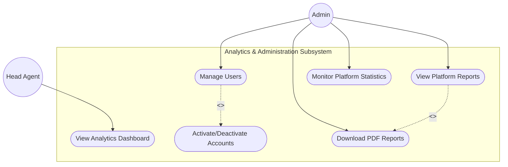

# Elite Estate UML Use Case Diagrams

This document contains the complete, modular UML Use Case specifications for the Elite Estate real estate automation project. The platform's use cases are separated into **six distinct subsystem diagrams** to maintain readability, clarity, and standardized UML modeling.

---

## Actor Generalization (Hierarchy)
*   `Visitor <|-- Client`: Registered clients inherit all guest capabilities (browsing, search, maps) and unlock personal services (AI semantic search, scheduling visits, Telegram Q&A).
*   `Agent <|-- HeadAgent`: The Head Agent inherits all sub-agent visit and transaction request processing duties, extending them to listing properties, uploading assets, and assigning properties to agents.

---

## 1. Global System Overview
Provides a high-level overview of the major platform domains and entry points for each actor.

```mermaid
graph TD
    Visitor((Visitor))
    Client((Client))
    Agent((Agent))
    HeadAgent((Head Agent))
    Admin((Admin))

    Client --|> Visitor
    HeadAgent --|> Agent

    subgraph Elite Estate Platform
        Auth[("Authentication & Authorization Subsystem")]
        Prop[("Property Management Subsystem")]
        Visit[("Visit Management Subsystem")]
        Trans[("Transaction Subsystem")]
        AdminSub[("Analytics & Administration Subsystem")]
    end

    Visitor --> Auth
    Visitor --> Prop
    Client --> Visit
    Agent --> Visit
    Agent --> Trans
    HeadAgent --> Prop
    HeadAgent --> AdminSub
    Admin --> AdminSub
    Admin --> Prop
```

---

## 2. Authentication & Authorization Subsystem
Models secure onboarding, authentication, session termination, and mandatory security checks.

```mermaid
graph TB
    Visitor((Visitor))
    Client((Client))
    Agent((Agent))
    HeadAgent((Head Agent))
    Admin((Admin))

    Client --|> Visitor
    HeadAgent --|> Agent

    subgraph Authentication & Authorization
        UC_Reg(["Register Account"])
        UC_Login(["Login to Platform"])
        UC_Logout(["Logout"])
        UC_JWT(["JWT Authentication"])
        UC_AuthZ(["Role Authorization"])
    end

    Visitor --> UC_Reg
    Visitor --> UC_Login
    Client --> UC_Logout
    Agent --> UC_Logout
    Admin --> UC_Logout

    UC_Login -. "<<include>>" .-> UC_JWT
    UC_Login -. "<<include>>" .-> UC_AuthZ
```

---

## 3. Property Management Subsystem
Models listings, search capabilities, semantic lookups, and asset management.

```mermaid
graph TB
    Visitor((Visitor))
    Client((Client))
    Agent((Agent))
    HeadAgent((Head Agent))
    Admin((Admin))

    Client --|> Visitor
    HeadAgent --|> Agent

    subgraph Property Management Subsystem
        UC_Browse(["Browse listings"])
        UC_Search(["Search properties"])
        UC_Semantic(["Semantic natural-language search"])
        UC_Details(["View property details & map"])
        UC_Create(["Create property listing"])
        UC_Edit(["Edit property listing"])
        UC_Delete(["Delete property listing"])
        UC_Assign(["Assign property to Agent"])
        UC_Upload(["Upload property images"])
        UC_Features(["Add amenities / features"])
    end

    Visitor --> UC_Browse
    Visitor --> UC_Search
    Visitor --> UC_Details
    Client --> UC_Semantic
    Agent --> UC_Details
    HeadAgent --> UC_Create
    HeadAgent --> UC_Edit
    HeadAgent --> UC_Delete
    HeadAgent --> UC_Assign
    Admin --> UC_Browse
    Admin --> UC_Details
    Admin --> UC_Delete

    UC_Create -. "<<include>>" .-> UC_Upload
    UC_Create -. "<<include>>" .-> UC_Features
    UC_Search -. "<<extend>>" .-> UC_Semantic
```

---

## 4. Visit Management Subsystem
Outlines schedule viewing, booking appointments, status updates, and reminder dispatches.

```mermaid
graph TB
    Client((Client))
    Agent((Agent))
    HeadAgent((Head Agent))

    HeadAgent --|> Agent

    subgraph Visit Management Subsystem
        UC_Schedule(["Schedule Visit"])
        UC_ViewSchedule(["View Visit Schedule"])
        UC_UpdateStatus(["Update Visit Status"])
        UC_Cancel(["Cancel Visit"])
        UC_Complete(["Complete Visit"])
        UC_Reminder(["Send Visit Reminder"])
    end

    Client --> UC_Schedule
    Client --> UC_ViewSchedule
    Agent --> UC_ViewSchedule
    Agent --> UC_UpdateStatus

    UC_UpdateStatus -. "<<extend>>" .-> UC_Cancel
    UC_UpdateStatus -. "<<extend>>" .-> UC_Complete
    UC_Schedule -. "<<include>>" .-> UC_Reminder
```

---

## 5. Transaction Subsystem
Tracks transaction requests, manager approval/rejection flows, and PDF report compilation.

```mermaid
graph TB
    Client((Client))
    Agent((Agent))
    HeadAgent((Head Agent))
    Admin((Admin))

    HeadAgent --|> Agent

    subgraph Transaction Subsystem
        UC_ReqSale(["Request Sale"])
        UC_ReqRent(["Request Rent"])
        UC_Approve(["Approve Transaction"])
        UC_Reject(["Reject Transaction"])
        UC_GenReport(["Generate Transaction Report"])
        UC_DownPDF(["Download PDF Report"])
    end

    Client --> UC_ReqSale
    Client --> UC_ReqRent
    Agent --> UC_ReqSale
    Agent --> UC_ReqRent
    HeadAgent --> UC_Approve
    HeadAgent --> UC_Reject
    HeadAgent --> UC_GenReport
    Admin --> UC_DownPDF

    UC_Approve -. "<<include>>" .-> UC_GenReport
    UC_GenReport -. "<<include>>" .-> UC_DownPDF
```

---

## 6. Analytics & Administration Subsystem
Models the full platform oversight, user activation, dashboard metrics, and report reviews.


